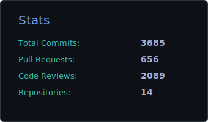
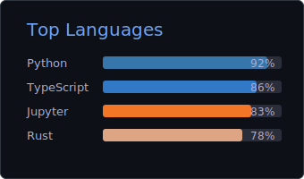
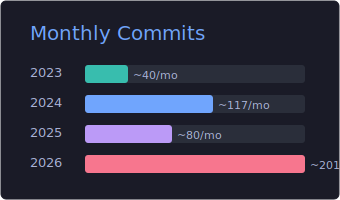

<div align="center">

## Hey, I'm Shalabh 🤙

**AI & Software Reliability Engineer**

*I build autonomous AI agents that write code and keep production systems alive.*

[](https://www.linkedin.com/in/shalabh-rocks/)
[](https://www.eventinc.de)
[](mailto:shalabh.pandey2611@gmail.com)

</div>

---

### 🤖 Right now I'm...

```diff
+ 🧠 Building autonomous AI agents that plan, code, test & deploy
+ 🔗 Wiring agents into real tools via MCP — GitHub, Sentry, Figma, Basecamp, Fly.io
+ ⚡ Designing multi-agent LLM pipelines with Claude, Codex & custom tool chains
! 🔧 Keeping EventInc's production rock-solid — observability, alerting, MTTR ↓
# 🏗️ Shipping Nexus — Elixir/Phoenix LiveView SaaS platform
```

---

### 🎯 Business Impact

<p align="center">
  
  
  
</p>
<p align="center">
  
  
  
</p>

---

### 📊 Contributions

<p align="center">
  
  
</p>
<p align="center">
  
</p>

---

### 🛠️ What I work with

<table>
  <tr>
    <td><b>🤖 AI & Agents</b></td>
    <td>
      
      
      
      
      
      
      
    </td>
  </tr>
  <tr>
    <td><b>⚙️ Backend</b></td>
    <td>
      
      
      
      
      
      
    </td>
  </tr>
  <tr>
    <td><b>🎨 Frontend</b></td>
    <td>
      
      
      
      
    </td>
  </tr>
  <tr>
    <td><b>🏗️ Infra & SRE</b></td>
    <td>
      
      
      
      
      
      
    </td>
  </tr>
  <tr>
    <td><b>🗄️ Databases</b></td>
    <td>
      
      
      
      
      
    </td>
  </tr>
</table>

---

### 🐍 Contribution Snake

<picture>
  <source media="(prefers-color-scheme: dark)" srcset="https://raw.githubusercontent.com/SRP2611/SRP2611/output/github-snake-dark.svg" />
  <source media="(prefers-color-scheme: light)" srcset="https://raw.githubusercontent.com/SRP2611/SRP2611/output/github-snake.svg" />
  
</picture>

---

<div align="center">


**11+ years in production** · Hamburg 🇩🇪
<br/>
🇬🇧 English (C2) · 🇩🇪 German (A1)

*"First, solve the problem. Then, write the code."*

</div>
